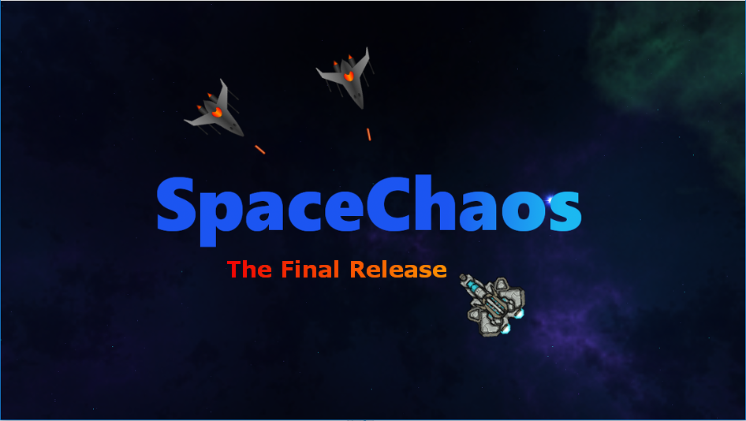

# SpaceChaos

[](https://travis-ci.org/opensourcegamedev/SpaceChaos)
Sonarqube: https://sonarqube.com/organizations/opensourcegamedev-spacechaos/projects

A simple 2D java game to learn some libGDX\
\


## Game Description

**SpaceChaos** is a space game by some **Indie Developers** in Germany, in which you have to fight
against enemy shuttles and try to destroy them all.
Your shuttle has to survive as long as possible.

## Control

The shuttle can be controlled with **mouse** (movement) and **space key & left/right mouse** to shoot.

## Start profiling

```
jcmd 13864 JFR.start duration=60s filename=myrecording2.jfr
```

## Credits

### Project Management

  - Justin Künzel

### Programmers

  - Justin Künzel
  - Cromewell (dogemagni)
  - Constantin Schulte (SupressWarnings)
  - javanewbie
  - damios
  - Adrian Buch
  - Markus Dohrmann
  
### Graphics

  - Paul Funk (pfau)
  - Constantin Schulte (SupressWarnings)
  - javanewbie
  
### Community, Marketing & PR Management

  - Constantin Schulte (SupressWarnings)
  
### Support

  - cain
  - flown
  - gab92
  - luggioh
  
### Webdesign

  - lars
  
### Special thanks
  
Also thanks to all other supporters and the libGDX team!
  
### Assets
The assets were made by others. All graphics (in most cases open source) are under a specific license.
You can find all graphic authors & contributors in **CONTRIBUTORS.md file**.

## Like this game
Give us a thumbs-up on pewn.de:<a href="https://pewn.de/games/815998-SpaceChaos/?vote=notify"></a>
